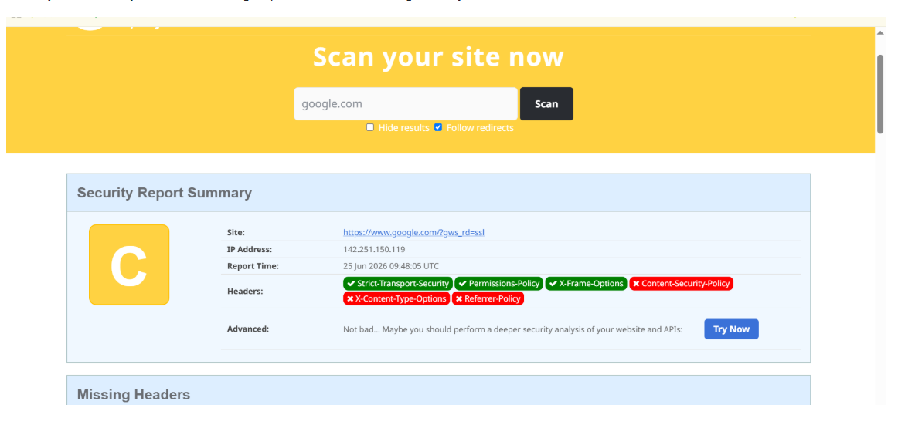

# 📸 Screenshots

## Overview

This folder contains screenshots collected during the cybersecurity assessment of the CoreTech Innovation web application.

These screenshots provide visual evidence supporting the findings documented in the project report.

---

# Screenshot 1 – OWASP Web Security Testing Guide

## Description

The OWASP Web Security Testing Guide (WSTG) was used as the primary methodology throughout this project. It provides industry-recognized guidance for assessing the security of web applications.

### Screenshot

---

# Screenshot 2 – Security Testing Process

## Description

The following workflow illustrates the methodology used during the assessment.

### Testing Workflow

1. Information Gathering
2. Configuration Testing
3. Authentication Testing
4. Authorization Testing
5. Input Validation Testing
6. Session Management Testing
7. Reporting and Findings

### Screenshot

---

# Screenshot 3 – Security Header Analysis

## Description

The website's HTTP security headers were analyzed to identify implemented and missing browser security protections.

### Observations

### Implemented Headers

- Strict-Transport-Security
- X-Frame-Options
- Permissions-Policy

### Missing Headers

- Content-Security-Policy
- Referrer-Policy
- X-Content-Type-Options

### Security Rating

**Overall Grade: C**

### Screenshot

---

# Summary

The screenshots included in this folder provide evidence for the assessment activities and support the findings presented in the final report. They demonstrate the application of the OWASP methodology and the evaluation of browser security configurations.

---

# Related Documents

- Main Project Report
- Findings Report
- Risk Assessment
- Recommendations

---

# Author

**Zeeshan Haider**

CoreTech Final Cybersecurity Project

Cybersecurity Internship

2026
