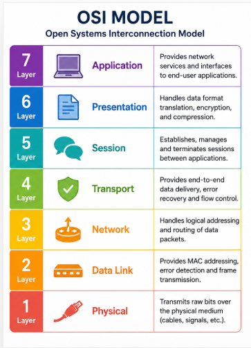
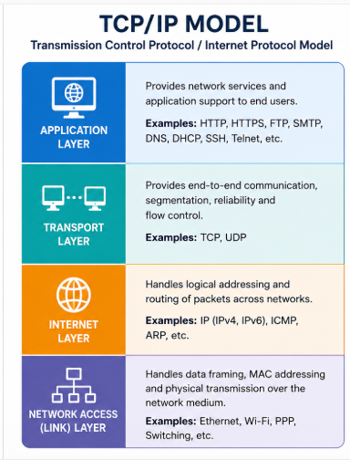

# Task 2: Networking Basics and Protocols

## Introduction

Networking is the foundation of communication between computers and devices. It allows systems to exchange information securely and efficiently.

---

# OSI Model

The OSI (Open Systems Interconnection) Model consists of 7 layers.

| Layer | Name | Function |
|---------|---------|---------|
| 7 | Application | Provides services to users |
| 6 | Presentation | Data formatting and encryption |
| 5 | Session | Establishes and manages sessions |
| 4 | Transport | Reliable data delivery |
| 3 | Network | Routing and IP addressing |
| 2 | Data Link | MAC addressing and frame transfer |
| 1 | Physical | Transmission of bits through cables |

## OSI Model Diagram

---

# TCP/IP Model

TCP/IP is the practical networking model used on the Internet.

| Layer | Function |
|---------|---------|
| Application | User services |
| Transport | TCP and UDP |
| Internet | IP addressing |
| Network Access | Physical transmission |

## TCP/IP Diagram

---

# Common Networking Protocols

## HTTP
HyperText Transfer Protocol used for websites.

## HTTPS
Secure version of HTTP using encryption.

## FTP
File Transfer Protocol used to transfer files.

## SSH
Secure Shell used for remote system access.

## DNS
Domain Name System converts domain names into IP addresses.

## DHCP
Dynamic Host Configuration Protocol automatically assigns IP addresses.

---

# IP Addressing

An IP address uniquely identifies a device on a network.

Example:

192.168.1.10

Types:

- Public IP
- Private IP
- IPv4
- IPv6

---

# Subnetting

Subnetting divides a large network into smaller networks.

Example:

Network:
192.168.1.0/24

Subnet Mask:
255.255.255.0

Benefits:

- Better security
- Efficient network management
- Reduced congestion

---

# TCP vs UDP

| TCP | UDP |
|------|------|
| Connection Oriented | Connectionless |
| Reliable | Faster |
| Error Checking | Less Overhead |
| Used in Web Browsing | Used in Streaming |

---

# Network Attacks

## Man-in-the-Middle Attack

An attacker intercepts communication between two parties.

## DNS Spoofing

Fake DNS responses redirect users to malicious websites.

## ARP Poisoning

Attackers send fake ARP messages to intercept traffic.

---

# Firewalls

A firewall monitors incoming and outgoing traffic and blocks unauthorized access.

Benefits:

- Blocks attacks
- Protects systems
- Controls network traffic

---

# Routers

Routers connect different networks and forward data packets to their destinations.

Functions:

- Route traffic
- Connect LAN to Internet
- Manage network communication

---

# Conclusion

Networking fundamentals are essential for cybersecurity professionals. Understanding OSI, TCP/IP, protocols, IP addressing, subnetting, network attacks, firewalls, and routers helps secure modern networks.
