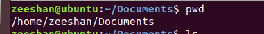
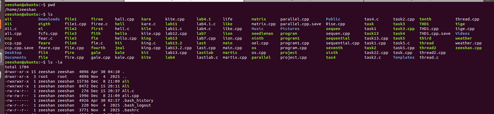
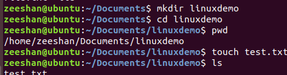
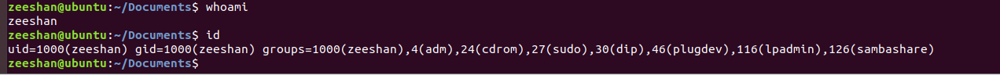

# Task 3: Linux Basics for Cybersecurity

This task covers basic Linux commands used in cybersecurity.

## Introduction

This task demonstrates basic Linux commands commonly used in cybersecurity and system administration. The commands cover file system navigation, file management, user information, networking, process management, and package management.

---

# 1. pwd

**Purpose:** Displays the current working directory.

**Command:**
```bash
pwd
```

**Screenshot:**



---

# 2. ls

**Purpose:** Lists files and directories.

**Command:**
```bash
ls
```

**Screenshot:**


---

# 3. ls -la

**Purpose:** Displays detailed information about files and hidden files.

**Command:**
```bash
ls -la
```

**Screenshot:**



---

# 4. mkdir

**Purpose:** Creates a new directory.

**Command:**
```bash
mkdir linuxdemo
```

**Screenshot:**



---

# 5. cd

**Purpose:** Changes the current directory.

**Command:**
```bash
cd linuxdemo
```

**Example Output:**
```bash
/home/zeeshan/Documents/linuxdemo
```

---

# 6. touch

**Purpose:** Creates an empty file.

**Command:**
```bash
touch test.txt
```

---

# 7. rm

**Purpose:** Removes files.

**Command:**
```bash
rm test.txt
```

---

# 8. rmdir

**Purpose:** Removes an empty directory.

**Command:**
```bash
rmdir linuxdemo
```

---

# 9. whoami

**Purpose:** Displays the current logged-in user.

**Command:**
```bash
whoami
```

**Screenshot:**



---

# 10. id

**Purpose:** Displays user ID and group information.

**Command:**
```bash
id
```

---

# 11. cat

**Purpose:** Displays file contents.

**Command:**
```bash
cat file.txt
```

---

# 12. cp

**Purpose:** Copies files and directories.

**Command:**
```bash
cp source.txt backup.txt
```

---

# 13. mv

**Purpose:** Moves or renames files.

**Command:**
```bash
mv old.txt new.txt
```

---

# 14. chmod

**Purpose:** Changes file permissions.

**Command:**
```bash
chmod 755 script.sh
```

---

# 15. chown

**Purpose:** Changes file ownership.

**Command:**
```bash
sudo chown user:user file.txt
```

---

# 16. ping

**Purpose:** Tests network connectivity.

**Command:**
```bash
ping google.com
```

**Screenshot:**


---

# 17. ifconfig

**Purpose:** Displays network interface configuration.

**Command:**
```bash
ifconfig
```

---

# 18. ps

**Purpose:** Displays running processes.

**Command:**
```bash
ps
```

---

# 19. top

**Purpose:** Displays real-time system processes and resource usage.

**Command:**
```bash
top
```

---

# 20. sudo apt update

**Purpose:** Updates package repository information.

**Command:**
```bash
sudo apt update
```

---

# Conclusion

Linux commands are essential tools for cybersecurity professionals. Understanding file management, user administration, networking, process monitoring, and package management is fundamental for security analysis, penetration testing, and system administration.

## Author

**Name:** Zeeshan Haider

**Internship:** CoreTech Cybersecurity Internship

**Task:** Linux Basics for Cybersecurity
