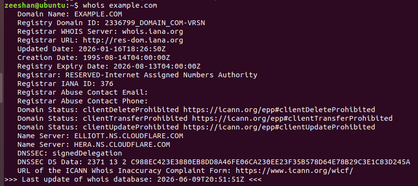
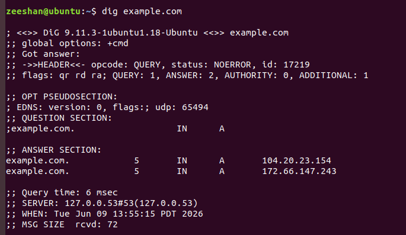
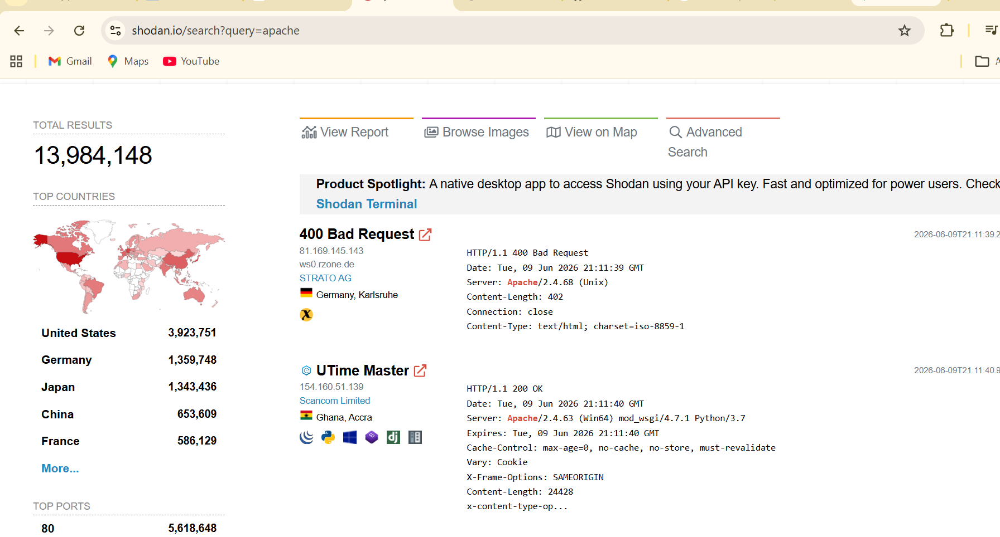

# Task 4: Reconnaissance and Information Gathering

## Introduction

Reconnaissance is the process of collecting information about a target before performing security testing. It helps security professionals understand systems, domains, and network infrastructure.

---

# Passive vs Active Reconnaissance

## Passive Reconnaissance

Information is collected without directly interacting with the target.

Examples:

- Google Search
- WHOIS Lookup
- Social Media Research
- Public DNS Records

Advantages:

- Difficult to detect
- No direct traffic to target

---

## Active Reconnaissance

Information is collected by directly interacting with the target.

Examples:

- Ping
- Port Scanning
- Banner Grabbing
- DNS Queries

Advantages:

- More detailed information

Disadvantages:

- Can be detected by security systems

---

# WHOIS Lookup

Command:

```bash
whois example.com
```



---

# NSLOOKUP

Command:

```bash
nslookup example.com
```


---

# DIG

Command:

```bash
dig example.com
```



---

# Google Dorking Examples

## Example 1

site:example.com


## Example 2

site:example.com filetype:pdf


## Example 3

site:example.com intitle:index.of


## Example 4

site:example.com inurl:admin


## Example 5

site:example.com filetype:txt


---

# Shodan Search Concept

Shodan is a search engine for Internet-connected devices. It helps security professionals discover exposed services and understand internet-facing systems.



---

# Conclusion

Reconnaissance is a critical phase of cybersecurity assessments. Passive techniques collect information without interacting with targets, while active techniques directly query systems for additional details. WHOIS, nslookup, dig, Google Dorking, and Shodan are valuable reconnaissance tools when used legally and ethically.
