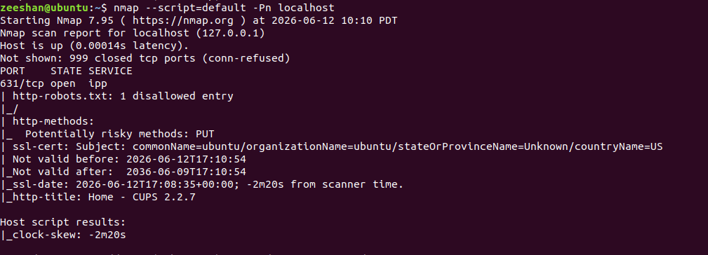

# Task 5: Vulnerability Scanning and Analysis

## Introduction

Vulnerability scanning is the process of identifying security weaknesses in systems, networks, and applications using automated tools. It helps organizations detect vulnerabilities before attackers can exploit them.

---

## What is Vulnerability Scanning?

Vulnerability scanning is an automated security testing process that identifies known vulnerabilities, misconfigurations, and security weaknesses in a target system.

---

## Why is Vulnerability Scanning Important?

- Detects security weaknesses before attackers find them.
- Improves overall security posture.
- Helps maintain compliance with security standards.
- Reduces the risk of cyberattacks.
- Assists in vulnerability management and remediation.
- Protects sensitive information and critical systems.

---

## Nmap Installation

Nmap (Network Mapper) is a popular open-source tool used for network discovery and security auditing.

### Installation Command

```bash
sudo apt update
sudo apt install nmap -y
```

### Verify Installation

```bash
nmap --version
```

### Screenshot


---

## Port Scanning with Nmap

### Command Used

```bash
nmap -Pn localhost
```

### Purpose

Scans localhost for open ports and running services.

### Findings

- Host: localhost (127.0.0.1)
- Open Port: 631/tcp
- Service: IPP (Internet Printing Protocol)

### Screenshot


---

## Service Detection Using Nmap Scripts

### Command Used

```bash
nmap --script=default -Pn localhost
```

### Purpose

Runs Nmap NSE (Nmap Scripting Engine) scripts to gather additional information about services running on the target.

### Findings

- Open Port: 631/tcp
- Service: IPP
- HTTP methods detected
- SSL certificate information displayed
- HTTP title identified as "Home - CUPS 2.2.7"

### Screenshot

---

## Understanding CVE

CVE (Common Vulnerabilities and Exposures) is a public database of cybersecurity vulnerabilities. Each vulnerability receives a unique identifier.

---

## Five Real-World CVEs

### CVE-2021-44228 (Log4Shell)

**Description:** Critical remote code execution vulnerability in Apache Log4j.

**Severity:** Critical (CVSS 10.0)

### CVE-2017-0144 (EternalBlue)

**Description:** SMB vulnerability exploited by WannaCry ransomware.

**Severity:** Critical (CVSS 8.1)

### CVE-2023-34362 (MOVEit Transfer)

**Description:** SQL Injection vulnerability affecting MOVEit Transfer.

**Severity:** Critical (CVSS 9.8)

### CVE-2024-3094 (XZ Utils Backdoor)

**Description:** A malicious backdoor discovered in XZ Utils software.

**Severity:** Critical (CVSS 10.0)

### CVE-2023-4863 (libwebp)

**Description:** Buffer overflow vulnerability in the WebP image library.

**Severity:** Critical (CVSS 8.8)

---

## CVSS Scoring System

CVSS (Common Vulnerability Scoring System) is used to measure the severity of vulnerabilities.

| CVSS Score | Severity |
|------------|----------|
| 0.0 – 3.9 | Low |
| 4.0 – 6.9 | Medium |
| 7.0 – 8.9 | High |
| 9.0 – 10.0 | Critical |

---

## Vulnerability Scan Report Template

### Scan Information

| Item | Details |
|------|---------|
| Target | localhost |
| IP Address | 127.0.0.1 |
| Tool Used | Nmap 7.95 |
| Scan Date | June 2026 |

### Findings

| Port | Service | Status |
|------|---------|--------|
| 631 | IPP | Open |

### Risk Assessment

The identified IPP service is commonly used for printing services. No critical vulnerabilities were detected during this basic scan.

**Risk Level:** Low

### Recommendations

- Keep software updated.
- Apply security patches regularly.
- Disable unnecessary services.
- Restrict network access where appropriate.
- Perform routine vulnerability assessments.

---

## Conclusion

This task demonstrated the use of Nmap for vulnerability scanning and service detection. The localhost system was scanned successfully, and an open IPP service was identified on port 631. Nmap NSE scripts provided additional service information. Understanding CVE and CVSS helps security professionals identify, assess, and prioritize vulnerabilities effectively.

---

## Author

**Name:** Zeeshan Haider

**Internship:** CoreTech Innovations Cybersecurity Internship

**Task:** Task 5 – Vulnerability Scanning and Analysis
