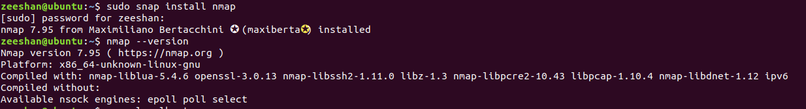
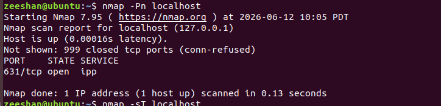

# Task 5: Vulnerability Scanning and Analysis

## Introduction

Vulnerability scanning is an automated process used to identify security weaknesses in systems, networks, and applications. It helps organizations discover vulnerabilities before attackers can exploit them.

---

# What is Vulnerability Scanning?

Vulnerability scanning is the process of examining systems, networks, and applications for known security flaws using specialized tools. These tools compare system information against databases of known vulnerabilities and generate reports on potential risks.

---

# Why is Vulnerability Scanning Important?

- Detects security weaknesses before attackers find them.
- Improves overall security posture.
- Helps maintain compliance with security standards.
- Reduces the risk of cyberattacks.
- Assists in vulnerability management and remediation.
- Protects sensitive information and critical systems.

---

# Nmap Installation

Nmap (Network Mapper) is a popular open-source tool used for network discovery and vulnerability assessment.

### Installation Command

```bash
sudo apt update
sudo apt install nmap -y
```

### Verify Installation

```bash
nmap --version
```

### Screenshot



---

# Port Scanning with Nmap

### Command Used

```bash
nmap -Pn localhost
```

### Purpose

Scans localhost for open ports and running services.

### Output Summary

- Host: localhost (127.0.0.1)
- Open Port Found: 631/tcp
- Service: IPP (Internet Printing Protocol)

### Screenshot



---

# Service Detection Using Nmap Scripts

### Command Used

```bash
nmap --script=default -Pn localhost
```

### Purpose

Runs Nmap NSE (Nmap Scripting Engine) scripts to gather additional information about services running on the target.

### Findings

- Open Port: 631/tcp
- Service: IPP (Internet Printing Protocol)
- HTTP methods detected
- SSL certificate information displayed
- HTTP title identified as "Home - CUPS 2.2.7"

### Screenshot


---

# Understanding CVE

CVE (Common Vulnerabilities and Exposures) is a public database of cybersecurity vulnerabilities. Each vulnerability receives a unique CVE identifier.

---

# Five Real-World CVEs

## 1. CVE-2021-44228 (Log4Shell)

### Description

A critical remote code execution vulnerability affecting Apache Log4j.

### Severity

Critical (CVSS 10.0)

---

## 2. CVE-2017-0144 (EternalBlue)

### Description

A vulnerability in Microsoft's SMB protocol exploited by WannaCry ransomware.

### Severity

Critical (CVSS 8.1)

---

## 3. CVE-2023-34362 (MOVEit Transfer)

### Description

SQL Injection vulnerability affecting MOVEit Transfer software.

### Severity

Critical (CVSS 9.8)

---

## 4. CVE-2024-3094 (XZ Utils Backdoor)

### Description

A malicious backdoor discovered in XZ Utils compression software.

### Severity

Critical (CVSS 10.0)

---

## 5. CVE-2023-4863 (libwebp)

### Description

Buffer overflow vulnerability in the WebP image library.

### Severity

Critical (CVSS 8.8)

---

# CVSS Scoring System

CVSS (Common Vulnerability Scoring System) is used to measure the severity of security vulnerabilities.

| CVSS Score | Severity |
|------------|----------|
| 0.0 - 3.9 | Low |
| 4.0 - 6.9 | Medium |
| 7.0 - 8.9 | High |
| 9.0 - 10.0 | Critical |

### Example

Log4Shell (CVE-2021-44228) has a CVSS score of 10.0, which makes it a Critical vulnerability.

---

# Vulnerability Scan Report Template

## Scan Information

| Item | Details |
|--------|---------|
| Target | localhost |
| IP Address | 127.0.0.1 |
| Tool Used | Nmap 7.95 |
| Scan Date | June 2026 |

---

## Findings

| Port | Service | Status |
|--------|---------|---------|
| 631 | IPP | Open |

---

## Risk Assessment

The identified IPP service is commonly used for printing services. No critical vulnerabilities were detected during this basic scan.

Risk Level: Low

---

## Recommendations

- Keep all software updated.
- Apply security patches regularly.
- Disable unused services.
- Restrict unnecessary network access.
- Perform routine vulnerability assessments.

---

# Conclusion

This task demonstrated the use of Nmap for vulnerability scanning and service detection. The localhost system was scanned, and an open IPP service was identified on port 631. NSE scripts provided additional information about the service. Furthermore, CVE and CVSS concepts were studied to understand how vulnerabilities are identified and rated. Vulnerability scanning plays an important role in maintaining system security and reducing cyber risks.

---

# Author

**Name:** Zeeshan Haider

**Internship:** CoreTech Innovations Cybersecurity Internship

**Task:** Task 5 – Vulnerability Scanning and Analysis
