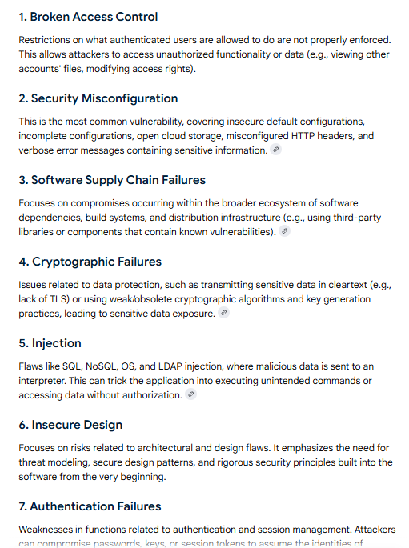
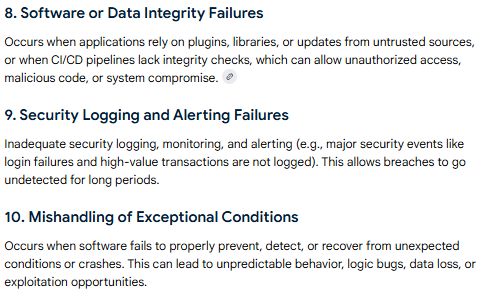
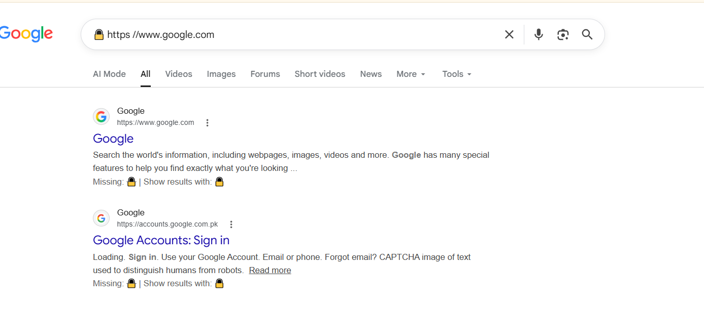
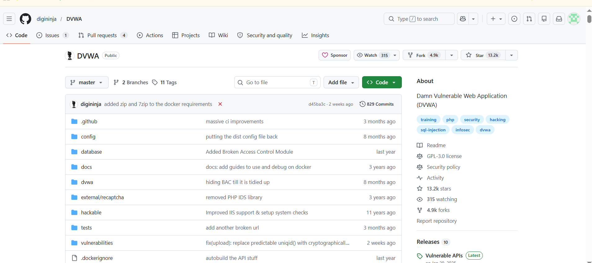

# Task 6: Web Application Security Basics

## Objective

The objective of this task is to understand fundamental web application security concepts, common vulnerabilities, and their prevention techniques. Practical learning was performed using DVWA (Damn Vulnerable Web Application) in a legal lab environment.

---

# OWASP Top 10 Vulnerabilities (2021)

## 1. Broken Access Control

Broken Access Control occurs when users can access resources or perform actions beyond their intended permissions.

### Example
A normal user changes a URL from:

```
/profile
```

to:

```
/admin
```

and gains unauthorized access.

### Prevention
- Role-Based Access Control (RBAC)
- Least Privilege Principle
- Server-side authorization checks

---

## 2. Cryptographic Failures

Cryptographic Failures occur when sensitive information is not properly protected.

### Example
Sending passwords over HTTP instead of HTTPS.

### Prevention
- Use HTTPS/TLS
- Encrypt sensitive data
- Secure password hashing

---

## 3. Injection

Injection vulnerabilities occur when user input is interpreted as commands or queries.

### Example

```sql
' OR '1'='1
```

### Prevention
- Parameterized queries
- Prepared statements
- Input validation

---

## 4. Insecure Design

Security weaknesses introduced during the design phase.

### Example
An online banking application without transaction limits.

### Prevention
- Secure design principles
- Threat modeling
- Security reviews

---

## 5. Security Misconfiguration

Occurs when systems are configured insecurely.

### Example
Using default administrator credentials.

### Prevention
- Remove default credentials
- Disable unnecessary services
- Apply secure configurations

---

## 6. Vulnerable and Outdated Components

Using software containing known vulnerabilities.

### Example
Running an outdated version of Apache or WordPress.

### Prevention
- Regular updates
- Patch management
- Vulnerability scanning

---

## 7. Identification and Authentication Failures

Weak authentication mechanisms allow attackers to impersonate users.

### Example
Using weak passwords such as:

```
123456
```

### Prevention
- Strong passwords
- Multi-Factor Authentication (MFA)
- Account lockout policies

---

## 8. Software and Data Integrity Failures

Trusting software or data without integrity verification.

### Example
Installing software updates from untrusted sources.

### Prevention
- Verify digital signatures
- Secure CI/CD pipelines
- Integrity validation

---

## 9. Security Logging and Monitoring Failures

Insufficient logging prevents detection of attacks.

### Example
No alert generated after repeated failed login attempts.

### Prevention
- Centralized logging
- Security monitoring
- Incident response plans

---

## 10. Server-Side Request Forgery (SSRF)

SSRF occurs when a server fetches attacker-controlled URLs.

### Example

```
http://localhost/admin
```
# OWASP Top 10 Vulnerabilities

## Screenshot





### Prevention
- URL validation
- Allow-list trusted destinations
- Network segmentation

---

# SQL Injection

## Concept

SQL Injection is a vulnerability where malicious SQL commands are inserted into input fields and executed by the database.

## Example

```sql
' OR '1'='1
```

This may bypass authentication and expose sensitive information.

## Prevention

- Prepared Statements
- Parameterized Queries
- Input Validation
- Least Privilege Database Accounts

---

# Cross-Site Scripting (XSS)

## Concept

Cross-Site Scripting (XSS) allows attackers to inject malicious JavaScript into web pages viewed by other users.

## Example

```html
<script>alert('XSS')</script>
```

## Prevention

- Input Validation
- Output Encoding
- Content Security Policy (CSP)

---

# Cross-Site Request Forgery (CSRF)

## Concept

CSRF tricks authenticated users into performing unwanted actions.

## Example

An attacker sends a malicious link that automatically submits a money transfer request while the victim is logged in.

## Prevention

- CSRF Tokens
- SameSite Cookies
- Re-authentication for critical actions

---

# Broken Authentication and Session Management

## Description

Occurs when authentication mechanisms or session management processes are implemented incorrectly.

## Risks

- Account takeover
- Session hijacking
- Unauthorized access

## Prevention

- Strong passwords
- Multi-Factor Authentication
- Secure session IDs
- Session timeout controls

---

# Security Misconfiguration

## Description

Security Misconfiguration occurs when servers, databases, frameworks, or applications are improperly configured.

## Examples

- Default credentials
- Open cloud storage
- Debug mode enabled in production

## Prevention

- Harden configurations
- Disable unused services
- Perform security audits

---

# How HTTPS Protects Web Traffic

HTTPS (HyperText Transfer Protocol Secure) uses SSL/TLS encryption to secure communication between clients and servers.

## Benefits

- Confidentiality
- Integrity
- Authentication
- Protection against Man-in-the-Middle (MITM) attacks

---

# HTTPS Example

The following screenshot demonstrates a secure HTTPS connection to Google. The lock icon indicates encrypted communication.

## Screenshot



---

# Practical Exercise Using DVWA

## Platform

DVWA (Damn Vulnerable Web Application)

## Activities Performed

- Studied SQL Injection module
- Studied XSS module
- Observed vulnerable web application behavior
- Learned secure coding practices
- Reviewed common attack vectors

## Screenshot




---

# Conclusion

This task provided practical and theoretical knowledge of web application security. The OWASP Top 10 vulnerabilities were studied, including SQL Injection, XSS, CSRF, Broken Authentication, and Security Misconfiguration. HTTPS security concepts were explored, and practical exercises were performed using DVWA in a legal testing environment. Understanding these vulnerabilities and mitigation techniques is essential for developing secure web applications.
