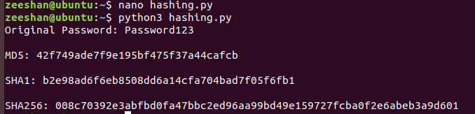

# Task 7: Password Security and Cryptography

## Objective

This task focuses on understanding password security and cryptography concepts including encryption, hashing algorithms, salting, SSL/TLS, password cracking concepts, and password security best practices.

---

# Symmetric vs Asymmetric Encryption

## Symmetric Encryption

Symmetric encryption uses the same key for both encryption and decryption.

### Examples

- AES (Advanced Encryption Standard)
- DES (Data Encryption Standard)
- Blowfish

### Advantages

- Fast encryption and decryption
- Suitable for large amounts of data

### Disadvantages

- Secure key exchange is required

---

## Asymmetric Encryption

Asymmetric encryption uses two keys:

- Public Key
- Private Key

### Examples

- RSA
- ECC (Elliptic Curve Cryptography)

### Advantages

- More secure key exchange
- Supports digital signatures

### Disadvantages

- Slower than symmetric encryption

---

## Comparison

| Feature | Symmetric Encryption | Asymmetric Encryption |
|----------|----------|----------|
| Keys Used | One Key | Two Keys |
| Speed | Fast | Slower |
| Security | Depends on Key Sharing | More Secure |
| Examples | AES, DES | RSA, ECC |

---

# Hashing Algorithms

Hashing converts input data into a fixed-length string called a hash.

## MD5

- Produces a 128-bit hash value.
- Fast but insecure.

Example:

```text
5f4dcc3b5aa765d61d8327deb882cf99
```

### Why MD5 is Insecure

- Vulnerable to collision attacks.
- Easily cracked using modern hardware.
- Not recommended for password storage.

---

## SHA-1

- Produces a 160-bit hash value.
- More secure than MD5 but now deprecated.

Example:

```text
a94a8fe5ccb19ba61c4c0873d391e987982fbbd3
```

---

## SHA-256

- Produces a 256-bit hash value.
- Currently considered secure for most applications.

Example:

```text
5e884898da28047151d0e56f8dc6292773603d0d6aabbdd62a11ef721d1542d8
```

---

# Password Hashing in Python

Python's hashlib library can generate hashes.

## Python Code

```python
import hashlib

password = "Password123"

print("Original Password:", password)

md5_hash = hashlib.md5(password.encode()).hexdigest()
sha1_hash = hashlib.sha1(password.encode()).hexdigest()
sha256_hash = hashlib.sha256(password.encode()).hexdigest()

print("\nMD5:", md5_hash)
print("\nSHA1:", sha1_hash)
print("\nSHA256:", sha256_hash)
```

## Screenshot



---

# Salting

Salting is the process of adding random data to a password before hashing.

## Example

Password:

```text
Password123
```

Salt:

```text
X7Y9Z2
```

Combined Value:

```text
Password123X7Y9Z2
```

### Importance of Salting

- Prevents rainbow table attacks.
- Makes password hashes unique.
- Increases password security.

---

# Password Cracking Concepts

Password cracking is performed only in authorized lab environments to evaluate password strength.

## Common Tools

- Hashcat
- John the Ripper

## Common Techniques

### Dictionary Attack

Uses a list of common passwords.

### Brute Force Attack

Tries every possible password combination.

### Hybrid Attack

Combines dictionary and brute-force methods.

### Purpose

- Security testing
- Password auditing
- Security awareness training

---

# SSL/TLS and Digital Certificates

SSL/TLS protects communication between users and web servers.

## How SSL/TLS Works

1. Client connects to the server.
2. Server sends a digital certificate.
3. Client verifies the certificate.
4. Encryption keys are exchanged.
5. Secure communication begins.

## Benefits

- Confidentiality
- Integrity
- Authentication

## HTTPS Example Screenshot


---

# Password Security Best Practices for CoreTech Innovation

1. Use passwords with at least 12 characters.
2. Enable Multi-Factor Authentication (MFA).
3. Avoid password reuse.
4. Use password managers.
5. Change compromised passwords immediately.
6. Store passwords using secure hashing algorithms.
7. Apply salting before hashing passwords.
8. Restrict login attempts.
9. Monitor authentication logs.
10. Train employees against phishing attacks.

---

# Conclusion

This task provided practical knowledge of password security and cryptography concepts. Symmetric and asymmetric encryption were studied, hashing algorithms were analyzed, password hashing was implemented using Python, salting concepts were explored, SSL/TLS was examined, and password security best practices were documented. These techniques help protect sensitive information and strengthen cybersecurity defenses.
