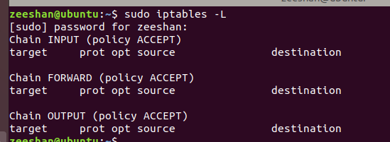
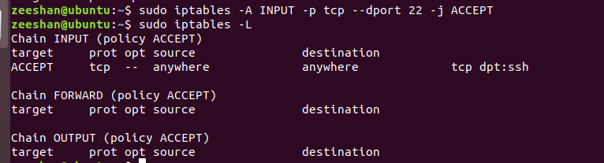
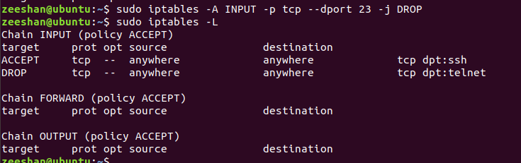
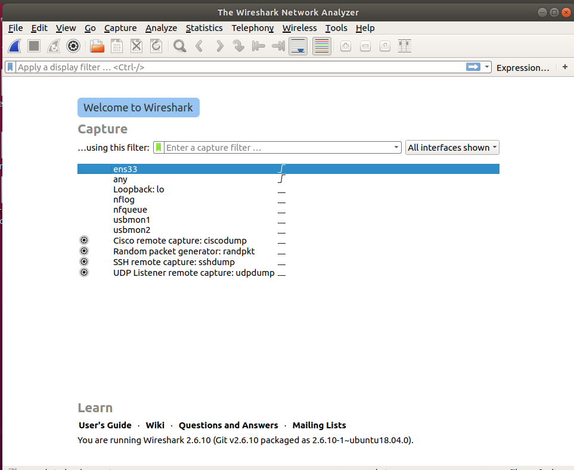
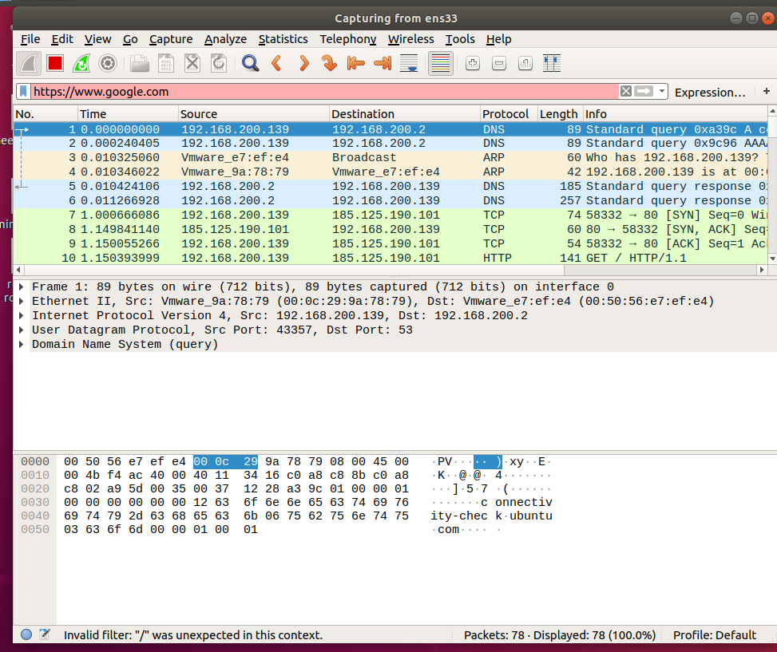
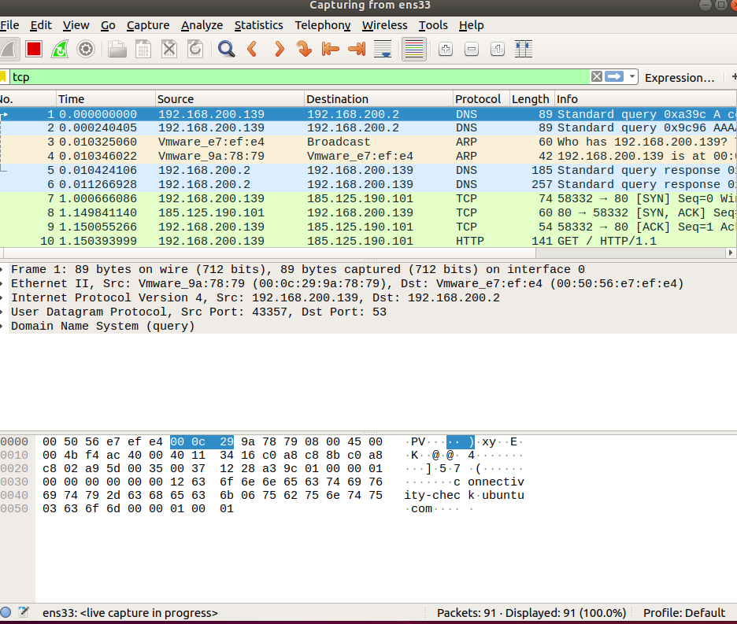
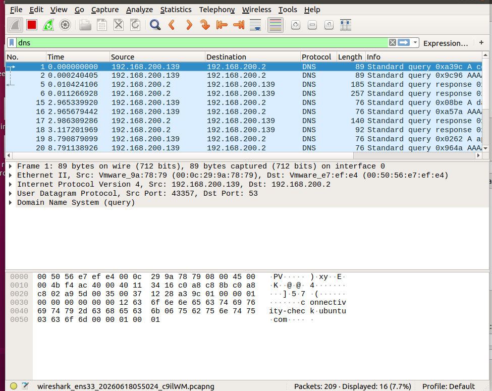

# Task 8: Network Security and Firewall Configuration

## Objective

The purpose of this task is to learn the fundamentals of network security, firewall configuration, IDS/IPS systems, VPN technology, and packet analysis using Wireshark.

---

# 1. Types of Firewalls

## Packet Filtering Firewall

A packet filtering firewall examines packets based on source IP address, destination IP address, protocol, and port number.

### Advantages

- Fast performance
- Low resource consumption
- Simple implementation

### Disadvantages

- Cannot inspect packet content
- Limited security capabilities

---

## Stateful Firewall

A stateful firewall monitors active connections and makes decisions based on connection states.

### Advantages

- Better security
- Tracks active sessions
- More intelligent filtering

### Disadvantages

- Requires more resources
- More complex configuration

---

## Application Layer Firewall

Application layer firewalls inspect traffic at the application level.

### Advantages

- Deep packet inspection
- Better protection against attacks
- Can filter specific applications

### Disadvantages

- Higher resource usage
- Increased complexity

---

# 2. Linux Firewall Configuration Using iptables

## Display Existing Rules

```bash
sudo iptables -L
```

### Screenshot



---

## Allow SSH Traffic

```bash
sudo iptables -A INPUT -p tcp --dport 22 -j ACCEPT
```

### Screenshot



---

## Block Telnet Traffic

```bash
sudo iptables -A INPUT -p tcp --dport 23 -j DROP
```

### Screenshot



---

# 3. Intrusion Detection System (IDS)

An Intrusion Detection System monitors network traffic and alerts administrators when suspicious activity is detected.

## Examples

- Snort
- Suricata
- Zeek

## Features

- Detects malicious activity
- Generates alerts
- Supports security monitoring

---

# 4. Intrusion Prevention System (IPS)

An Intrusion Prevention System actively blocks malicious traffic after detection.

## Features

- Real-time protection
- Automatic attack prevention
- Network threat mitigation

---

# 5. Difference Between IDS and IPS

| Feature | IDS | IPS |
|----------|----------|----------|
| Monitoring | Yes | Yes |
| Detection | Yes | Yes |
| Prevention | No | Yes |
| Traffic Blocking | No | Yes |
| Alert Generation | Yes | Yes |

---

# 6. Virtual Private Network (VPN)

A Virtual Private Network (VPN) creates an encrypted tunnel between a user and a remote network.

## Benefits

- Protects privacy
- Encrypts internet traffic
- Secures remote access
- Hides IP address

---

# 7. Wireshark Installation

Wireshark is a network protocol analyzer used to inspect network traffic.

## Installation Command

```bash
sudo apt update
sudo apt install wireshark -y
```

### Screenshot



---

# 8. Packet Capture Analysis

Wireshark was used to capture and analyze network packets.

### Screenshot



## Observed Protocols

- DNS
- TCP
- HTTP
- ARP

---

# 9. TCP Traffic Analysis

TCP packets were filtered using the following filter:

```text
tcp
```

### Screenshot



## Findings

- TCP handshake observed
- Client-server communication identified
- Destination port 80 detected

---

# 10. DNS Traffic Analysis

DNS packets were filtered using:

```text
dns
```

### Screenshot



## Findings

- DNS queries observed
- DNS responses captured
- Domain resolution process analyzed

---

# 11. Suspicious Traffic Identification

During packet analysis, the following traffic types were observed:

- DNS requests and responses
- TCP connection establishment
- HTTP communication
- ARP broadcasts

No malicious traffic was identified during the analysis session.

---

# 12. Network Security Policy for CoreTech Innovation

## Password Policy

- Use strong passwords
- Minimum 12 characters
- Enable multi-factor authentication

## Firewall Policy

- Allow only required ports
- Block unused services
- Regularly review firewall rules

## VPN Policy

- Use encrypted VPN connections
- Restrict unauthorized access

## Monitoring Policy

- Enable IDS/IPS systems
- Review logs regularly
- Investigate suspicious activities

## Update Policy

- Apply security patches regularly
- Keep systems updated
- Remove unsupported software

---

# Conclusion

This task provided practical experience with firewall configuration, IDS/IPS concepts, VPN security, and network traffic analysis using Wireshark. Packet filtering and protocol analysis demonstrated how network security tools help protect systems against unauthorized access and cyber threats.
