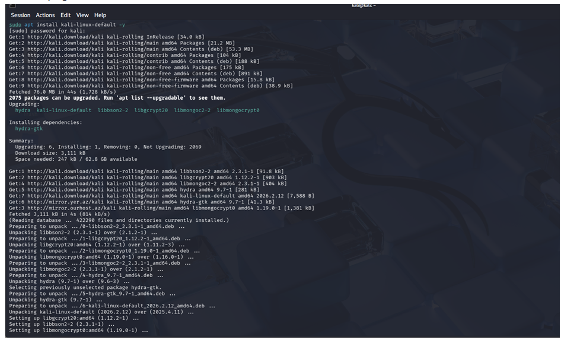
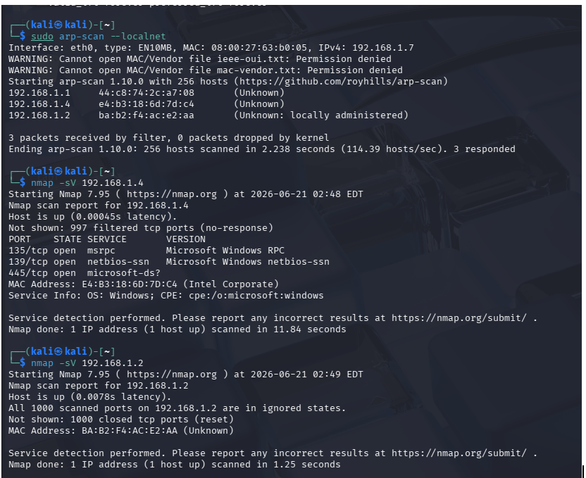
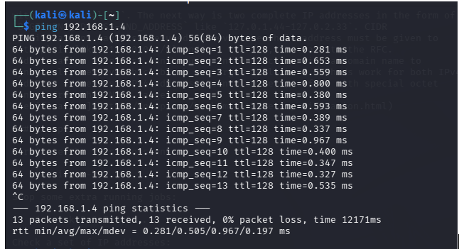
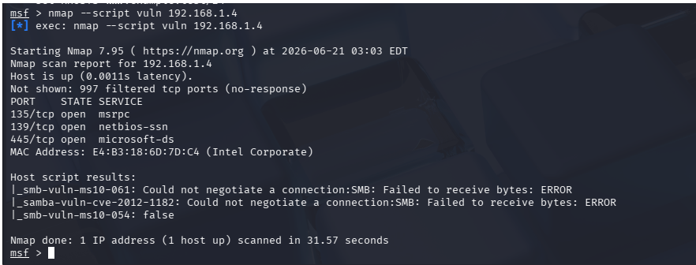
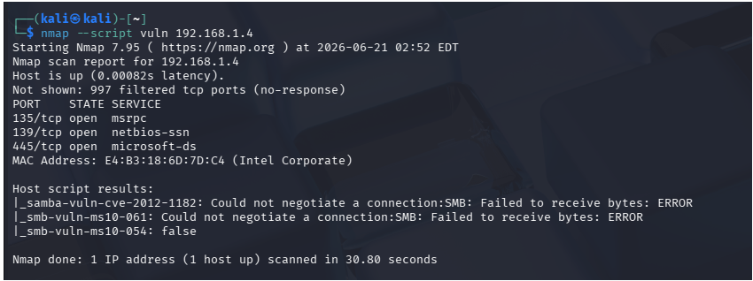
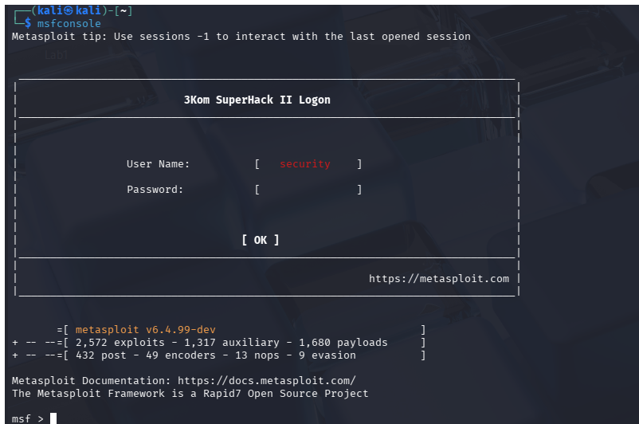
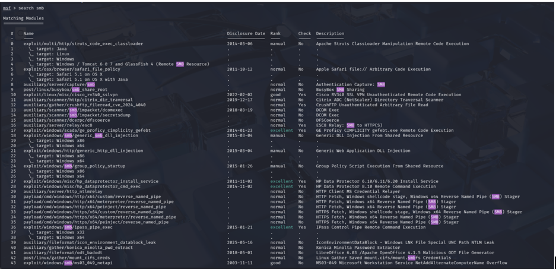
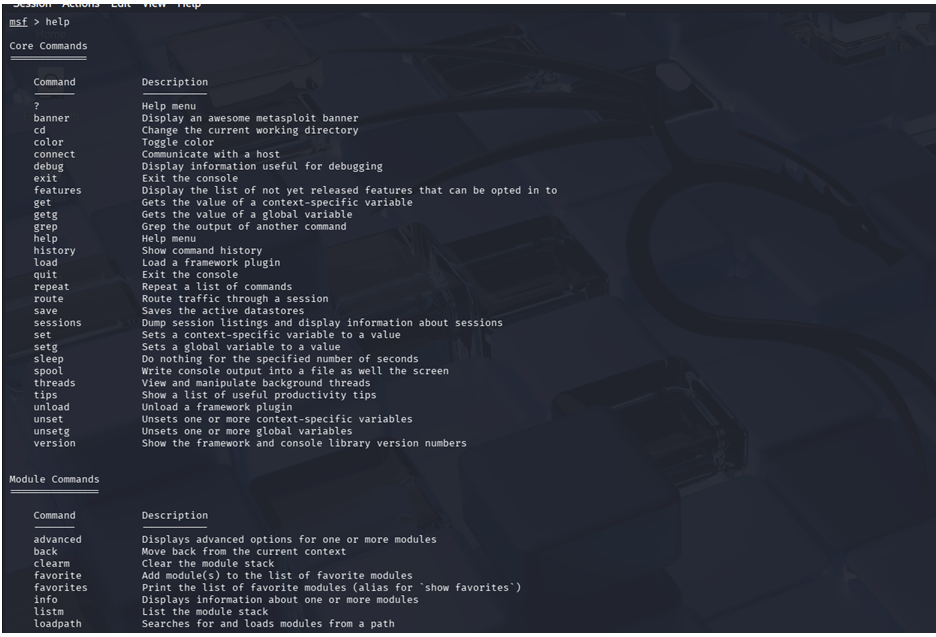

# Task 9: Ethical Hacking and Penetration Testing Basics

## Objective

The objective of this task is to understand the penetration testing methodology and practice basic ethical hacking techniques in a safe and legal lab environment using Kali Linux, Nmap, and Metasploit Framework.

---

# Lab Environment

## Tools Used

- Kali Linux
- Nmap
- Metasploit Framework
- ARP-Scan
- VirtualBox

## Kali Linux Setup

Kali Linux was configured as the attacker machine for reconnaissance, scanning, and vulnerability assessment.

### Screenshot



---

# Penetration Testing Methodology

## 1. Reconnaissance

Reconnaissance is the first phase of penetration testing where information about the target is collected. This may include discovering hosts, IP addresses, operating systems, and services running on the network.

## 2. Scanning

Scanning is performed to identify open ports, active services, and potential vulnerabilities on target systems.

## 3. Exploitation

Exploitation involves leveraging discovered vulnerabilities to gain unauthorized access. This phase should only be performed in authorized lab environments.

## 4. Post-Exploitation

Post-exploitation evaluates the impact of a successful compromise and identifies sensitive resources that may be accessible.

## 5. Reporting

The final phase documents findings, risks, and security recommendations.

---

# Host Discovery

The local network was scanned to identify active devices.

## Command

```bash
sudo arp-scan --localnet
```

## Result

The scan discovered active hosts on the local network:

- 192.168.1.1
- 192.168.1.2
- 192.168.1.4

## Screenshot



---

# Connectivity Verification

Connectivity with the target host was verified using ICMP ping.

## Command

```bash
ping 192.168.1.4
```

## Screenshot



---

# Service Enumeration

Nmap was used to identify open ports and running services.

## Command

```bash
nmap -sV 192.168.1.4
```

## Results

| Port | State | Service |
|--------|--------|---------|
| 135 | Open | Microsoft RPC |
| 139 | Open | NetBIOS Session Service |
| 445 | Open | SMB (Microsoft-DS) |

### Service Information

- Operating System: Microsoft Windows
- Open SMB Service
- NetBIOS Enabled
- Remote Procedure Call Service Active

## Screenshot



---

# Vulnerability Assessment

Nmap vulnerability detection scripts were executed against the target system.

## Command

```bash
nmap --script vuln 192.168.1.4
```

## Purpose

This scan checks for common vulnerabilities and security weaknesses associated with exposed services.

## Screenshot



---

# Metasploit Framework

Metasploit is a penetration testing framework used for vulnerability assessment, security research, and exploit development.

## Starting Metasploit

### Command

```bash
msfconsole
```

### Screenshot



---

## Searching for SMB Modules

### Command

```bash
search smb
```

### Screenshot



---

## Viewing Help Menu

### Command

```bash
help
```

### Screenshot



---

# Findings

The assessment identified a Windows-based host exposing several network services:

| Port | Service | Risk Level |
|--------|---------|-----------|
| 135 | MSRPC | Medium |
| 139 | NetBIOS | Medium |
| 445 | SMB | High |

Potential security concerns include:

- SMB service exposure
- NetBIOS information leakage
- Increased attack surface due to open network services

---

# Security Recommendations

1. Restrict SMB access through firewall rules.
2. Disable unnecessary services.
3. Apply operating system security updates regularly.
4. Use strong passwords and multi-factor authentication.
5. Monitor logs for suspicious activity.
6. Conduct regular vulnerability assessments.
7. Implement network segmentation where possible.

---

# Ethical Considerations

All testing performed in this task was conducted in a controlled lab environment for educational purposes only. No unauthorized systems were targeted.

---

# Conclusion

This task provided hands-on experience with the fundamental phases of penetration testing. Using Kali Linux, ARP-Scan, Nmap, and Metasploit Framework, host discovery, service enumeration, and vulnerability assessment techniques were successfully demonstrated. The exercise highlighted the importance of proper security configurations and regular security assessments in maintaining a secure network environment.
