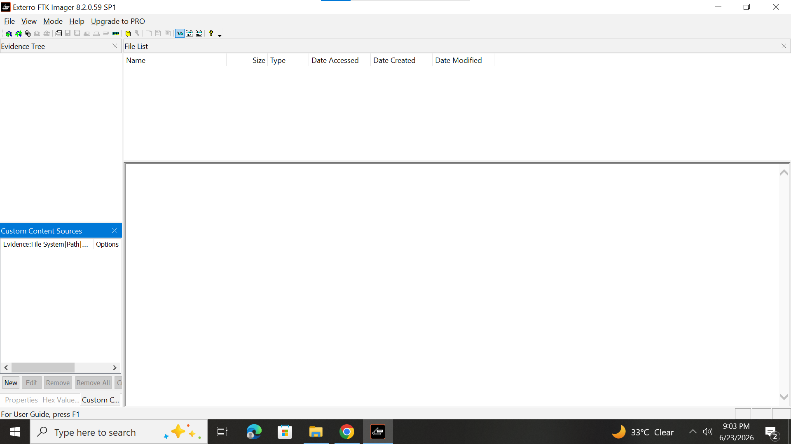
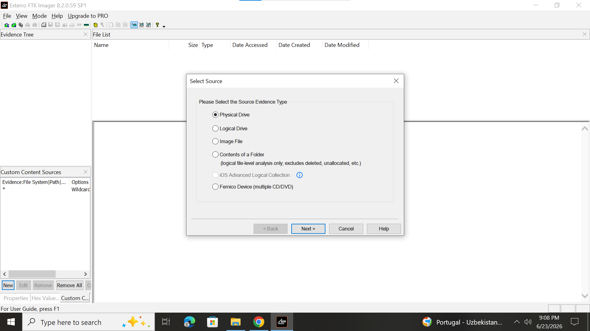
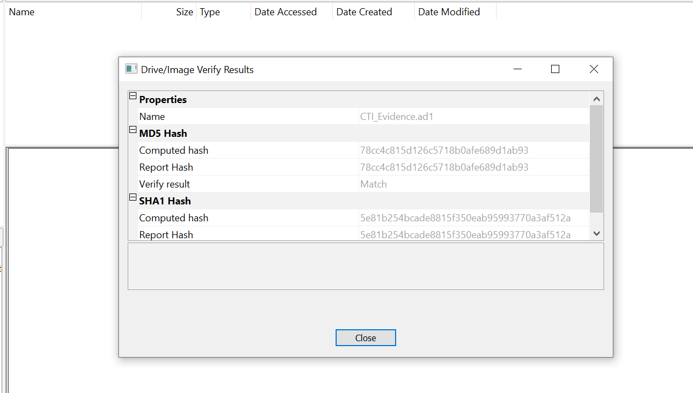
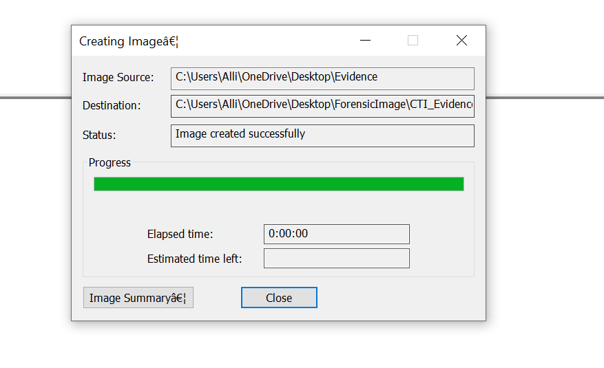

# Task 10: Incident Response and Digital Forensics

## Student Information

**Name:** Zeeshan Haider  
**Course:** Information Security

---

# Project Overview

This project demonstrates the concepts of Incident Response and Digital Forensics. It includes the Incident Response Lifecycle, a ransomware incident response plan for CoreTech Innovation, digital forensics fundamentals, forensic imaging using FTK Imager, log analysis, SIEM concepts, and a post-incident report template.

---

# Objectives

- Understand the Incident Response Lifecycle
- Develop a Ransomware Incident Response Plan
- Learn Digital Forensics Fundamentals
- Perform Forensic Imaging using FTK Imager
- Understand Log Analysis and SIEM Systems
- Create a Post-Incident Report Template

---

# Incident Response Lifecycle

## 1. Preparation

Preparation involves establishing security policies, creating backups, configuring security tools, and training employees before incidents occur.

## 2. Detection and Analysis

Security incidents are identified through alerts, monitoring systems, and log analysis.

## 3. Containment

The affected systems are isolated to prevent further damage and stop the attack from spreading.

## 4. Eradication

The root cause of the incident is removed, including malware and vulnerabilities.

## 5. Recovery

Systems and services are restored from backups and returned to normal operations.

## 6. Lessons Learned

The incident is reviewed to improve future security measures and response procedures.

---

# CoreTech Innovation Ransomware Response Plan

## Scenario

CoreTech Innovation experiences a ransomware attack that encrypts company files and demands payment.

### Identification

- Detect encrypted files
- Identify affected systems
- Confirm ransomware infection

### Containment

- Disconnect infected devices
- Disable shared folders
- Block malicious network connections

### Eradication

- Remove ransomware
- Patch vulnerabilities
- Reset compromised passwords

### Recovery

- Restore files from backups
- Verify system integrity
- Resume business operations

### Lessons Learned

- Review attack methods
- Improve security awareness
- Update incident response procedures

---

# Digital Forensics Basics

## Evidence Collection

Digital evidence may include:

- Hard Drives
- USB Devices
- Emails
- System Logs
- Memory Dumps

## Chain of Custody

Chain of custody documents every person who handles digital evidence.

### Importance

- Maintains evidence integrity
- Prevents tampering
- Supports legal investigations

## Disk Imaging

Disk imaging creates an exact copy of digital evidence for forensic analysis.

### Benefits

- Preserves original evidence
- Enables safe investigation
- Verifies integrity using hash values

---

# FTK Imager Practical

## Objective

To create and verify a forensic image using FTK Imager.

---

## FTK Imager Home Screen

The following screenshot shows FTK Imager after successful installation.



---

## Source Selection

The evidence source was selected using the "Contents of a Folder" option.



---

## Imaging Process

FTK Imager successfully created a forensic image from the evidence folder.



---

## Verification Results

The generated forensic image was verified using MD5 and SHA1 hash values.

### Verification Result

- MD5 Hash: Match
- SHA1 Hash: Match

This confirms that the forensic image is an exact copy of the original evidence and that no data was altered during the imaging process.



---

## Findings

- FTK Imager installed successfully.
- Sample evidence files were created.
- Forensic image generated successfully.
- MD5 hash verification passed.
- SHA1 hash verification passed.
- Evidence integrity maintained.

---

# Log Analysis

Log analysis is the process of reviewing logs to identify suspicious activities and security incidents.

## Common Log Sources

- Windows Event Logs
- Firewall Logs
- Web Server Logs
- Application Logs
- Authentication Logs

## Benefits

- Detect attacks
- Monitor user activity
- Investigate incidents
- Improve security

---

# SIEM (Security Information and Event Management)

SIEM systems collect and analyze security events from multiple sources.

## Functions

- Log Collection
- Event Correlation
- Real-Time Monitoring
- Alert Generation
- Incident Investigation

## Popular SIEM Tools

- Splunk
- IBM QRadar
- Microsoft Sentinel
- Elastic Security

## Benefits

- Centralized monitoring
- Faster incident response
- Improved security visibility
- Better compliance management

---

# Post-Incident Report Template

The repository includes a reusable post-incident report template containing:

- Incident Information
- Incident Summary
- Timeline
- Impact Assessment
- Root Cause Analysis
- Actions Taken
- Lessons Learned
- Recommendations

---

# Repository Files

```text
README.md
Incident_Response_Lifecycle.md
CoreTech_Ransomware_Response_Plan.md
Digital_Forensics_Basics.md
FTK_Imager_Practice.md
Log_Analysis_and_SIEM.md
Post_Incident_Report_Template.md

ftk_home.png
source_selection.png
imaging_process.png
imaging_complete.png
```

---

# Conclusion

This project successfully demonstrated Incident Response and Digital Forensics concepts through both theoretical explanations and practical forensic imaging using FTK Imager. The forensic image was successfully verified using MD5 and SHA1 hashes, confirming evidence integrity and authenticity.
