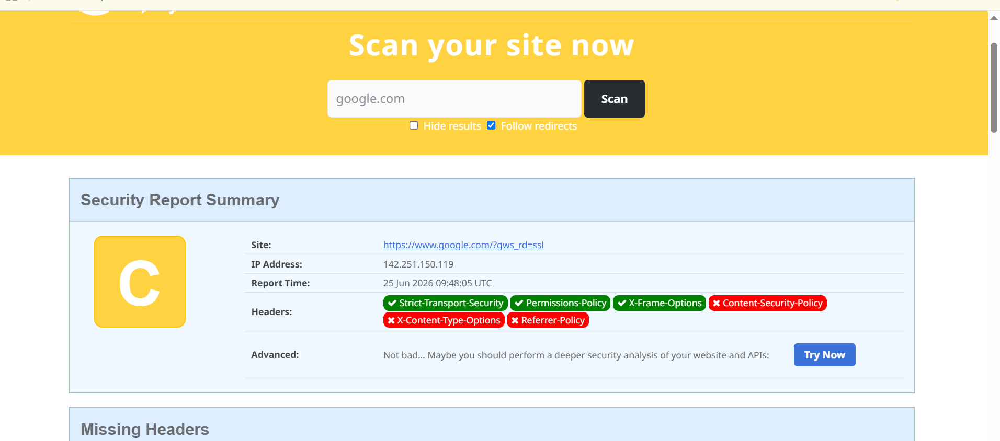

# Web Application Security Testing Report
## CoreTech Innovation Internship - Task 11

### Project Overview

This project demonstrates a basic Web Application Security Assessment using the OWASP Web Security Testing Guide (WSTG) methodology.

The objective of this assessment is to identify common web application security weaknesses, evaluate risks, and provide recommendations to improve the security posture of the application.

---

# Objectives

- Understand OWASP Web Security Testing Methodology
- Perform basic web application security assessment
- Identify potential vulnerabilities
- Analyze security headers
- Document findings and recommendations
- Produce a professional security assessment report

---

# Scope

The assessment focuses on:

- Information Gathering
- Configuration Testing
- Authentication Testing
- Authorization Testing
- Input Validation Testing
- Session Management Testing
- Security Header Analysis

---

# Methodology

This assessment follows the OWASP Web Security Testing Guide (WSTG).

### Testing Phases

1. Information Gathering
2. Configuration and Deployment Management Testing
3. Authentication Testing
4. Authorization Testing
5. Session Management Testing
6. Input Validation Testing
7. Security Misconfiguration Testing
8. Reporting and Recommendations

---

# Risk Rating Scale

| Risk Level | Description |
|------------|------------|
| Critical | Immediate exploitation possible with severe impact |
| High | Significant security weakness requiring urgent action |
| Medium | Moderate risk requiring remediation |
| Low | Minor security concern |
| Informational | No immediate risk |

---

# Findings

## Finding 1: Missing Content Security Policy

### Description

The application does not implement a Content Security Policy (CSP).

### Risk Level

Medium

### Impact

Without CSP, the application may be more vulnerable to Cross-Site Scripting (XSS) attacks.

### Recommendation

Implement a strict Content Security Policy to control allowed content sources.

---

## Finding 2: Missing X-Content-Type-Options Header

### Description

The X-Content-Type-Options header is not configured.

### Risk Level

Medium

### Impact

Browsers may perform MIME-type sniffing, increasing attack surface.

### Recommendation

Configure:

```http
X-Content-Type-Options: nosniff
```

---

## Finding 3: Missing Referrer Policy

### Description

The Referrer Policy header is absent.

### Risk Level

Low

### Impact

Sensitive information may be leaked through referrer headers.

### Recommendation

Configure:

```http
Referrer-Policy: strict-origin-when-cross-origin
```

---

# Security Header Assessment

## Present Security Headers

- Strict-Transport-Security
- Permissions-Policy
- X-Frame-Options

## Missing Security Headers

- Content-Security-Policy
- X-Content-Type-Options
- Referrer-Policy

---

# Recommendations

1. Implement Content Security Policy (CSP)
2. Enable X-Content-Type-Options
3. Configure Referrer Policy
4. Perform regular vulnerability assessments
5. Conduct periodic penetration testing
6. Keep software and dependencies updated
7. Enforce secure coding practices

---

# Conclusion

The assessment identified several missing security headers that may expose the application to security risks. While some important protections are already implemented, additional hardening measures should be applied to improve the overall security posture.

---

# Screenshots

## OWASP Methodology

The OWASP Web Security Testing Guide was used as the primary testing methodology.


---

## Security Testing Process

The following process was followed during the assessment.


---

## Findings Evidence

Security header analysis results showing implemented and missing security headers.



---

# Tools Used

- OWASP Web Security Testing Guide (WSTG)
- SecurityHeaders.com
- Web Browser Developer Tools
- GitHub

---

# Author

**Zeeshan Haider**

CoreTech Innovation Internship

Cybersecurity Internship Program

2026
